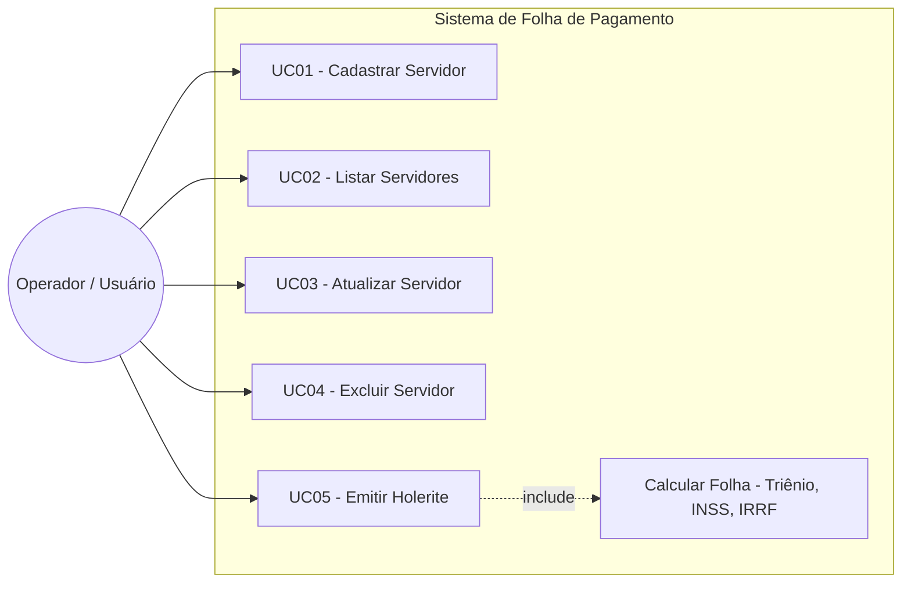
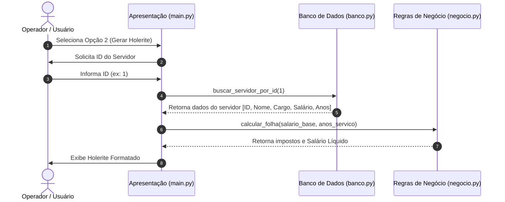

# 📑 Sistema de Folha de Pagamento - Prefeitura Municipal

Protótipo de Engenharia de Software focado na aplicação prática do Modelo de Processo em Cascata.

## 📌 Descrição do Projeto

Este projeto consiste em um protótipo de sistema para gerenciamento e cálculo da folha de pagamento.

## 🎯 Objetivo

Desenvolvido no contexto acadêmico do curso de Análise e Desenvolvimento de Sistemas, o projeto demonstra como seria o desenvolvimento de software utilizando o Modelo em Cascata. Estruturando as fases de Análise de Requisitos, Design de Software, Implementação e Testes.

Para isto foi escolhido um cenário hipotético onde o aluno teria que desenvolver um sistema de folha de pagamentos para uma prefeitura, um domínio de negócio burocrático e regido por regras fixas, onde requisitos bem definidos na fase inicial minimizam mudanças de escopo ao longo do ciclo de desenvolvimento.

## ⚙️ Funcionalidades

- Gestão de Servidores (CRUD)

Cadastrar novo servidor público (Nome, Cargo, Salário Base e Anos de Serviço).

Listar servidores cadastrados com identificação única.

Atualizar dados de um servidor (Cargo, Salário Base e Tempo de Serviço).

Remover registro de servidor do sistema.

- Cálculo de Folha e Emissão de Holerite

Cálculo automático de adicional por tempo de serviço (Triênio: 3% a cada 3 anos completos).

Cálculo de deduções previdenciárias organizacionais (INSS).

Cálculo de retenção de imposto de renda (IRRF).

Emissão e exibição do holerite detalhado com Salário Bruto e Líquido.

## 🌊 Utilização do Modelo em Cascata

### 1. Especificação de Requisitos

Nesta primeira etapa, é levado em conta o escopo do projeto antes do início de qualquer desenvolvimento. As regras de negócio e os requisitos funcionais são consolidados para evitar mudanças futuras.

#### Requisitos Funcionais:

- Requisito 1: O sistema deve permitir o cadastro de servidores públicos com ID único, nome, cargo, salário base e anos de serviço. Assim como também deve permitir a leitura, atualização e remoção destes mesmos cadastros.

- Requisito 2: O sistema deve emitir o holerite com detalhamento de adicionais, descontos e o salário líquido final.

### 2. Projeto de Software

Etapa onde define-se a arquitetura do sistema e a modelagem dos dados. A abordagem adotada foi o padrão de Arquitetura em Camadas para manter o código modular e de fácil manutenção.

Arquitetura do Sistema:

- Camada de Persistência (banco.py): Uso do SQLite para criação da tabela "servidores" e execução de queries SQL (CRUD).

- Camada de Regras de Negócio (negocio.py): Isolamento de todas as fórmulas financeiras.

- Camada de Apresentação (main.py): Menu interativo e captura de entradas do usuário via terminal.

**Modelagem do Banco de Dados**:

id:

nome:

cargo:

salario_base:

anos_servico:

### 3. Implementação
Nesta etapa, o design é traduzido em código executável em Python. Cada camada é construída respeitando a dependência unidirecional (a apresentação consome o negócio, e o negócio consome o banco).

Construção dos Módulos:

Criação do script banco.py com garantia de tabelas automáticas.

Implementação das funções matemáticas puras em conta.py.

Integração das chamadas em main.py no loop do menu interativo.

### 4. Validação

Testes manuais das 5 opções do menu para verificar o correto funcionamento das funções e atualização do banco.

## 📐 Diagramas e UI

### 1. Diagrama de Casos de uso
Representa as interações do operador com os casos de uso do sistema.

### 2. Diagrama de Sequência
Demonstra a comunicação em camadas durante a emissão do holerite (Opção 2 do menu).

### UI:
https://www.figma.com/make/LF3bfbxL16onv2Z7eCMKaj/Sistema-de-Registro-de-Funcion%C3%A1rios?t=ESJnEbhHwRYok2Ri-20&fullscreen=1

## 🛠️ Tecnologias Utilizadas

### Back-end

### 🎨 Front-end

### 🗄️ Banco de Dados

## 🗺️ Roadmap de Evoluções pós-Protótipo

### Fase 1: Qualidade e Segurança Básica (Hardening)

Objetivo: Tornar o código atual à prova de falhas causadas pelo usuário.

- [ ] Tratamento de Exceções (try/except): Impedir que o programa quebre se o usuário digitar texto em campos numéricos (como digitar "quatro mil" no salário).

- [ ] Validação de Entradas: Garantir que valores como salario_base e anos_servico não aceitem números negativos.

- [ ] Gerenciamento Seguro de Conexão: Implementar blocos with conn: ou try/finally no banco.py para garantir o fechamento e commit correto das transações.

### Fase 2: Arquitetura e Organização (Refatoração)

Objetivo: Aplicar conceitos mais avançados de Engenharia de Software no próprio Python.

- [ ] Introdução à Orientação a Objetos (POO): Transformar os dados do servidor que hoje transitam como tuplas (servidor[3], servidor[4]) em objetos de uma classe Servidor.

### Fase 3: Expansão do Negócio e Relatórios

Objetivo: Tornar as regras do sistema mais próximas da realidade.

- [ ] Tabelas de Alíquotas Reais: Atualizar o negocio.py para usar faixas progressivas reais de INSS e IRRF (em vez de porcentagens fixas).

- [ ] Exportação de Dados: Adicionar uma função para exportar a lista de servidores ou o holerite para um arquivo CSV ou TXT.

### Fase 4: Primeira Interface Gráfica ou Web

Objetivo: Levar a aplicação para fora do terminal.

- [ ] Plataforma Web Inicial (Flask): Transformar o menu CLI em uma página web simples em HTML com rotas em Flask.
